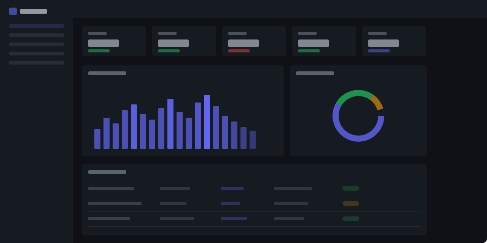

<p align="center">
  <picture>
    <source media="(prefers-color-scheme: dark)" srcset="brand/logo-wordmark-light.svg">
    <source media="(prefers-color-scheme: light)" srcset="brand/logo-wordmark.svg">
    
  </picture>
</p>

<p align="center">
  <b>AI engineering analytics for Claude Code teams.</b>
</p>

<p align="center">
  <a href="docs/getting-started.md">Get Started</a> &middot;
  <a href="docs/api.md">API Docs</a> &middot;
  <a href="ROADMAP.md">Roadmap</a> &middot;
  <a href="CONTRIBUTING.md">Contributing</a>
</p>

<p align="center">
  <a href="https://github.com/ccf/primer/actions/workflows/ci.yml"></a>
  
  
  
</p>

---

<!-- TODO: Replace with an actual dashboard screenshot or animated GIF (1280x720+) -->

<p align="center">
  
</p>

---

Primer is a self-hosted analytics platform that turns [Claude Code](https://docs.anthropic.com/en/docs/claude-code) session data into actionable insights for engineering teams. It shows where AI assistance accelerates work, where engineers hit friction, and what it costs — so teams can make informed decisions about AI adoption, training, and tooling.

## Features

- **Team Dashboard** — Session volume, token usage, cost trends, and activity heatmaps across your org with previous-period comparisons
- **Cost Analysis** — Per-model spend tracking with daily cost charts, model breakdowns, and budget visibility
- **Engineer Profiles** — Personal trajectory dashboards with weekly sparklines, strengths, friction breakdown, and peer benchmarking
- **Friction Detection** — Surface where engineers struggle: tool errors, permission blocks, timeouts, and context limits
- **Anomaly Alerts** — Automatic detection of cost spikes, usage drops, and success rate degradation with configurable thresholds
- **AI Maturity Scoring** — Tool leverage scores, category usage, project AI-readiness checks, and agent/skill analytics
- **Session Browser** — Full-text search with outcome, type, and model filters plus transcript viewer with message-level detail
- **GitHub Integration** — OAuth SSO, pull request sync, commit correlation, and repository AI-readiness scoring
- **MCP Sidecar** — Claude queries your team's own usage patterns mid-session: stats, friction reports, recommendations
- **Role-Based Access** — Engineers see their profile; leadership sees the org dashboard; admins manage teams and thresholds
- **Dark Mode** — Light, dark, and system-preference themes
- **Export** — CSV and PDF export from any view

## Quickstart

```bash
pip install -e ".[dev]"       # Install dependencies
alembic upgrade head           # Initialize database
uvicorn primer.server.app:app --reload  # Start API server
```

```bash
cd frontend && npm install && npm run dev  # Start dashboard
```

Visit `http://localhost:5173`. Run `python scripts/seed_data.py` to populate sample data.

See the [Getting Started](docs/getting-started.md) guide for GitHub integration, hook setup, and production deployment.

## How It Works

Primer has four components that work together:

```
Claude Code ──SessionEnd Hook──▶ Primer API ◀──MCP Sidecar
                                     │
                                     ▼
                              PostgreSQL / SQLite
                                     │
                                     ▼
                              React Dashboard
```

1. **SessionEnd Hook** — Automatically uploads session transcripts after each Claude Code session
2. **REST API** — FastAPI service that stores sessions, computes analytics, and serves the dashboard
3. **Dashboard** — React + Tailwind CSS frontend with role-based views and real-time filtering
4. **MCP Sidecar** — Lets Claude query your team's data during conversations

## Install the Hook

```bash
export PRIMER_SERVER_URL=http://localhost:8000
export PRIMER_API_KEY=primer_...       # Your engineer API key
python scripts/install_hook.py
```

This adds a `SessionEnd` hook to `~/.claude/settings.json`. Sessions are uploaded automatically after every Claude Code conversation.

## Add the MCP Server

Register Primer as an MCP server so Claude can query your team's patterns mid-session:

```bash
export PRIMER_SERVER_URL=http://localhost:8000
export PRIMER_ADMIN_API_KEY=your-admin-key
python -m primer.mcp.server
```

Tools: `sync` &middot; `my_stats` &middot; `team_overview` &middot; `friction_report` &middot; `recommendations`

## Documentation

| Guide | Description |
|-------|-------------|
| **[Getting Started](docs/getting-started.md)** | Installation, setup, first dashboard |
| **[GitHub Integration](docs/github-integration.md)** | OAuth login, GitHub App for PR sync |
| **[Configuration](docs/configuration.md)** | All environment variables and options |
| **[API Reference](docs/api.md)** | Endpoints, authentication, request/response schemas |
| **[Architecture](docs/architecture.md)** | System design, data model, request flows |
| **[Deployment](docs/deployment.md)** | Docker Compose, PostgreSQL, scaling |

## About the Name

Named after the Young Lady's Illustrated Primer in Neal Stephenson's *The Diamond Age* — an adaptive, AI-driven book that observes its reader, understands context, and transforms complexity into personalized guidance. Primer brings that same principle to engineering organizations.

## Contributing

We welcome contributions. See [CONTRIBUTING.md](CONTRIBUTING.md) for guidelines.

- [Open issues](https://github.com/ccf/primer/issues) — bugs and feature requests
- [Roadmap](ROADMAP.md) — what's planned and complete

## License

[MIT](LICENSE)
