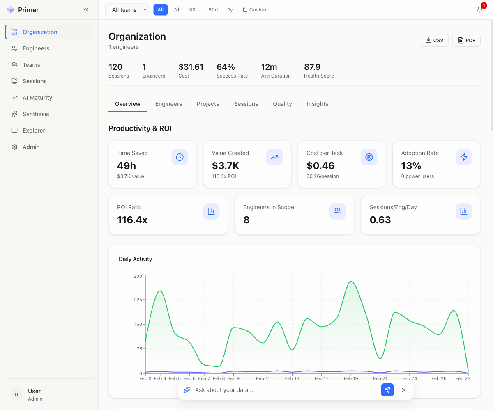
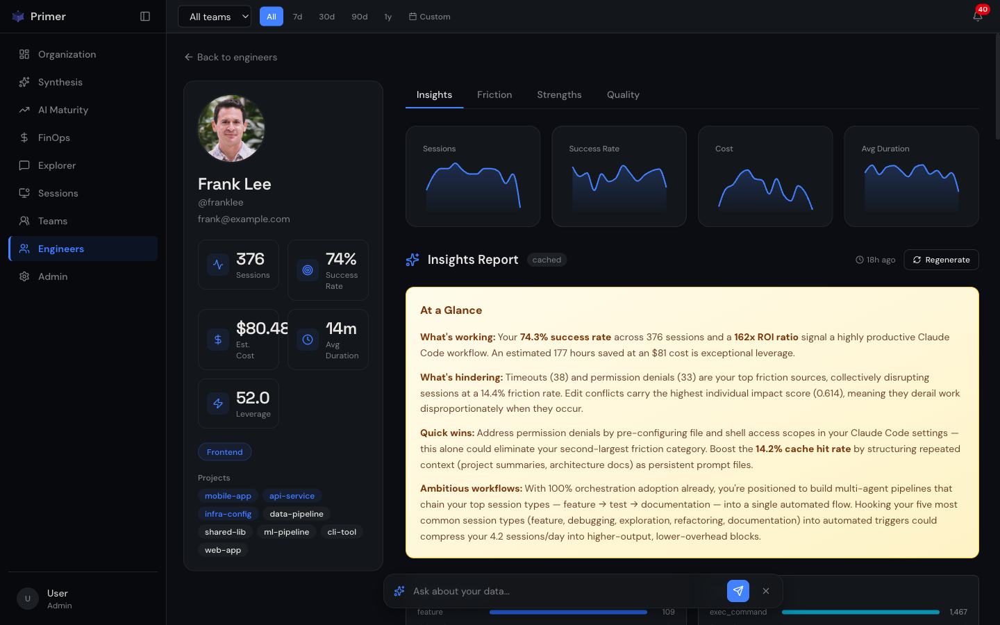
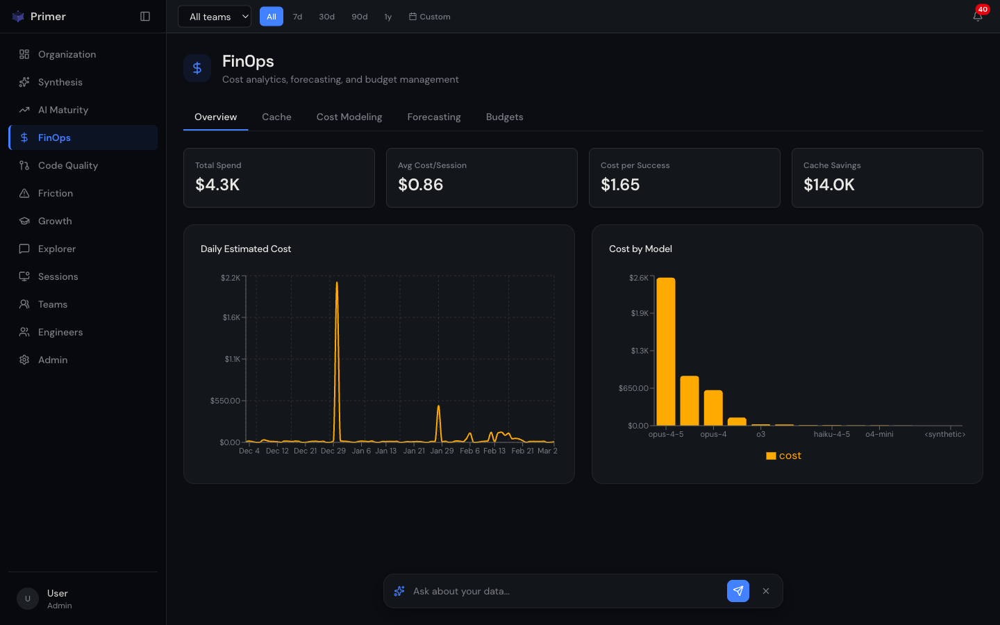

<p align="center">
  <picture>
    <source media="(prefers-color-scheme: dark)" srcset="brand/logo-wordmark-light.svg">
    <source media="(prefers-color-scheme: light)" srcset="brand/logo-wordmark.svg">
    
  </picture>
</p>

<p align="center">
  <b>Understand how your engineers use AI — and how to make them better at it.</b>
</p>

<p align="center">
  <a href="https://useprimer.dev/docs/installation/">Get Started</a> &middot;
  <a href="https://useprimer.dev/docs/">Docs</a> &middot;
  <a href="ROADMAP.md">Roadmap</a> &middot;
  <a href="CONTRIBUTING.md">Contributing</a>
</p>

<p align="center">
  <a href="https://github.com/ccf/primer/actions/workflows/ci.yml"></a>
  
  
  
</p>

---

<p align="center">
  <picture>
    <source media="(prefers-color-scheme: dark)" srcset="docs/images/dashboard-dark.png">
    <source media="(prefers-color-scheme: light)" srcset="docs/images/dashboard-light.png">
    
  </picture>
</p>

---

Your team adopted AI coding tools. Now what?

Primer is an open-source intelligence platform that captures session data from [Claude Code](https://docs.anthropic.com/en/docs/claude-code), [Codex CLI](https://github.com/openai/codex), and [Gemini CLI](https://github.com/google-gemini/gemini-cli) — then answers the questions that no other tool can. Self-hosted. Privacy-first. Your data never leaves your network.

## Questions Primer Answers

### For engineering leadership

- **Is our AI investment paying off?** — Cost per successful outcome, ROI ratio, time saved vs. dollars spent
- **Which teams have figured it out and which are struggling?** — Team-level adoption, success rates, and leverage scores with cross-team comparison
- **What systemic issues tank AI effectiveness across the org?** — Friction impact scoring: not just "errors happen" but "this error type costs us 40% lower success rates"
- **Are we spending efficiently?** — Per-engineer plan modeling (API vs. Pro vs. Max), cache hit optimization, budget burn-rate tracking

### For team leads

- **Who needs help and what specific help?** — Personalized tips, skill gaps, tool diversity analysis, and peer benchmarking
- **How fast are new hires ramping up?** — Cohort analysis comparing onboarding curves against team baselines
- **Are AI-assisted PRs actually better?** — Side-by-side comparison: merge time, review comments, merge rate for Claude vs. non-Claude PRs
- **Where should I invest in training?** — Tool proficiency scoring (novice → expert) per engineer, per tool category

### For individual engineers

- **How am I trending?** — Weekly trajectory with success rate, cost, and session patterns
- **What keeps tripping me up?** — Personal friction breakdown: permission blocks, context limits, tool errors
- **Am I using the right tools?** — Config optimization suggestions based on team benchmarks and entropy-based diversity scoring
- **What should I try next?** — Learning paths generated from high-performer patterns in your org

<p align="center">
  
</p>

## What Makes This Different

**Friction analysis, not just usage tracking.** Primer doesn't just count sessions — it classifies *why* sessions fail. LLM-powered facet extraction identifies goals, satisfaction, and friction types from every transcript, then scores their impact on outcomes. You learn that `permission_denied` errors cause 40% lower success rates, not just that they happen sometimes.

**Individual intelligence, not just org dashboards.** Every engineer gets a trajectory view, strengths profile, friction breakdown, and AI-generated narrative about their patterns. The MCP sidecar lets Claude query your own stats mid-session — "what's my success rate this week?" — without leaving your editor.

**Cost optimization, not just cost tracking.** Primer models whether each engineer should be on API billing, Pro ($20/mo), or Max ($100/mo) based on actual usage. It measures cache hit rates per engineer and surfaces how much money is being left on the table. Budget burn-rate alerts catch overruns before they happen.

**AI maturity scoring.** A composite leverage score (0-100) per engineer based on tool category diversity, orchestration adoption, and cache efficiency. Track your org's maturity curve over time. Detect which projects have CLAUDE.md, AGENTS.md, and proper AI configuration — and which don't.

<p align="center">
  
</p>

## Capabilities

| Area | What You Get |
|------|-------------|
| **Organization Overview** | Session volume, success rates, health scores, activity heatmaps, outcome distribution, anomaly alerts |
| **FinOps & Cost Management** | Per-model spend, cache savings analysis, API vs. subscription modeling, 30-day linear regression forecasting, budget burn-rate tracking |
| **Engineer Profiles** | Weekly trajectory sparklines, strengths/friction breakdown, peer benchmarking, AI-generated narrative insights |
| **AI Maturity** | Leverage scores, tool category analysis, orchestration adoption rates, project AI-readiness detection |
| **Friction Intelligence** | Categorized friction types with impact scoring, bottleneck detection, root cause patterns, cluster analysis |
| **Quality & Code Impact** | PR merge rates, Claude-assisted vs. non-Claude comparison, code volume per session, review comment analysis |
| **AI Synthesis** | LLM-generated narrative reports at org, team, and engineer scope — turns metrics into stories |
| **Conversational Explorer** | Natural language queries over your data via SSE-streamed tool-use chat |
| **Session Browser** | Full-text search, outcome/model/type filters, transcript viewer, message-level detail |
| **MCP Sidecar** | Engineers query their own stats mid-session: trends, friction reports, recommendations |
| **Multi-Agent Support** | Claude Code, Codex CLI, and Gemini CLI sessions in one platform |
| **GitHub Integration** | OAuth SSO, PR sync, commit correlation, repository AI-readiness scoring |

## Quickstart

**One-liner install:**

```bash
curl -fsSL https://useprimer.dev/install.sh | sh
```

**Or install manually:**

```bash
pip install primer            # Install
primer init                      # Initialize database and config
primer server start              # Start API + dashboard
primer hook install              # Register the SessionEnd hook
```

**Docker:**

```bash
cp .env.docker.example .env && make up
```

See the [Installation guide](https://useprimer.dev/docs/installation/) for full setup, GitHub integration, and production configuration.

## How It Works

```
AI Coding Tools ──SessionEnd Hook──▶ Primer API ◀──MCP Sidecar
 (Claude Code,                           │
  Codex CLI,                             ▼
  Gemini CLI)                    PostgreSQL / SQLite
                                         │
                                         ▼
                                  React Dashboard
```

1. **SessionEnd Hook** — Captures transcripts automatically after each AI coding session. LLM-powered facet extraction classifies goals, friction, and satisfaction.
2. **REST API** — FastAPI service with 14 routers covering analytics, alerting, FinOps, quality, maturity, and more. Role-based access at every layer.
3. **Dashboard** — React frontend with org, team, and individual views. Date-range filtering, CSV/PDF export, dark mode.
4. **MCP Sidecar** — Engineers query their own data during Claude Code sessions without context switching.

## Documentation

| | Guide | Description |
|-|-------|-------------|
| **Getting Started** | [Installation](https://useprimer.dev/docs/installation/) | Install, configure, first insights |
| | [Configuration](https://useprimer.dev/docs/configuration/) | Environment variables and options |
| | [CLI Reference](https://useprimer.dev/docs/cli/) | All `primer` commands |
| **Architecture** | [Server & API](https://useprimer.dev/docs/server/) | System design, data model, auth, endpoints |
| | [Hook System](https://useprimer.dev/docs/hooks/) | Multi-agent extractor registry |
| | [MCP Sidecar](https://useprimer.dev/docs/mcp/) | Mid-session stats, friction reports, recommendations |
| **Guides** | [GitHub Integration](https://useprimer.dev/docs/github/) | OAuth login, GitHub App for PR sync |
| | [FinOps & Cost Management](https://useprimer.dev/docs/finops/) | Cache analytics, cost modeling, forecasting, budgets |
| | [Alert Thresholds](https://useprimer.dev/docs/alerts/) | Anomaly detection and Slack notifications |
| | [Deployment](https://useprimer.dev/docs/deployment/) | Docker Compose, Helm, PostgreSQL, scaling |

## About the Name

Named after the Young Lady's Illustrated Primer in Neal Stephenson's *The Diamond Age* — an adaptive, AI-driven book that observes its reader, understands context, and transforms complexity into personalized guidance. Primer brings that same principle to engineering organizations: observe how your team uses AI, understand the patterns, and guide each engineer toward mastery.

## Contributing

We welcome contributions. See [CONTRIBUTING.md](CONTRIBUTING.md) for guidelines.

- [Open issues](https://github.com/ccf/primer/issues) — bugs and feature requests
- [Roadmap](ROADMAP.md) — what's planned and complete

## License

[MIT](LICENSE)
